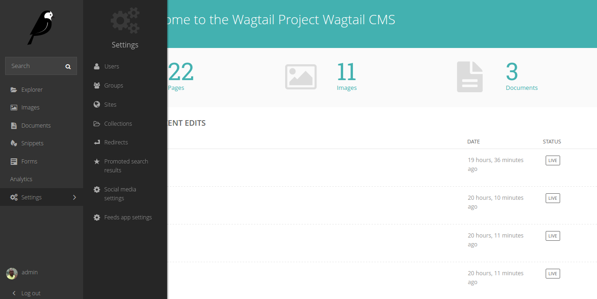
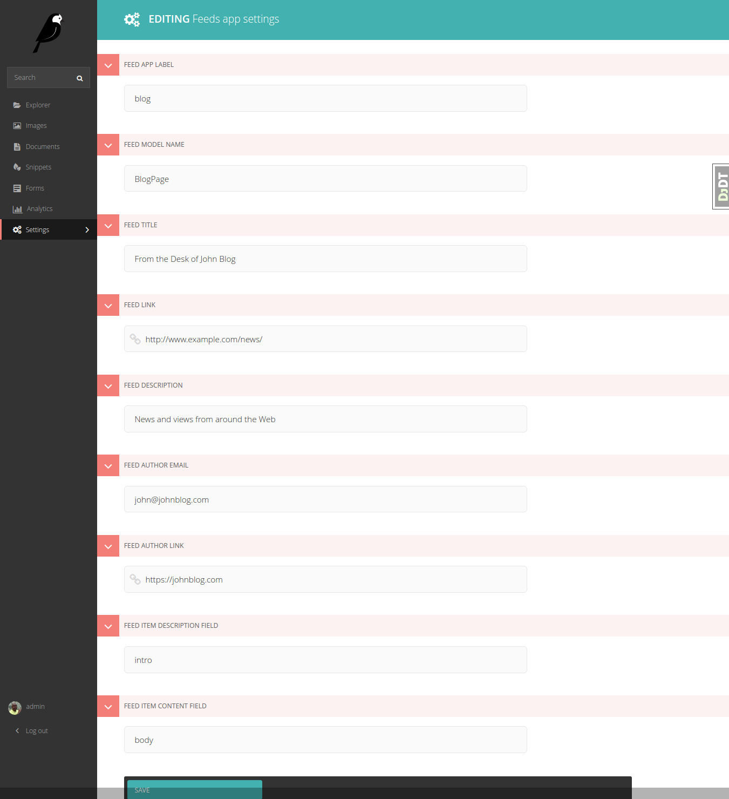

Django Wagtail Feeds
====================
.. image:: https://travis-ci.org/chrisdev/django-wagtail-feeds.svg?branch=master
    :target: https://travis-ci.org/chrisdev/django-wagtail-feeds
    
.. image:: https://img.shields.io/pypi/v/wagtail_feeds.svg
        :target: https://pypi.python.org/pypi/django-wagtail-feeds

.. image:: https://readthedocs.org/projects/wagtail-feeds/badge/?version=latest
        :target: https://django-wagtail-feeds.readthedocs.io/en/latest/?badge=latest
        :alt: Documentation Status

Support RSS Feeds, Facebook Instant Articles and Apple News. Syndication feeds come in two flavors:

- **BasicFeed** -  A standard `RSS V 2.0.1`_ feed designed to be used without item enclosures.

- **ExtendedFeed** - An RSS V2/Atom Feed with support for item  
   enclosures such as images or video. Use this if when want to integrate your feed with services like MailChimp or Flipboard.

.. _`RSS V 2.0.1` : http://cyber.law.harvard.edu/rss/rss.html

Getting Started
---------------

To use Django Wagtail Feeds in a project::

    pip install wagtail_feeds
    
Remember to add ``wagtail_feeds`` to installed apps in settings file.
    
Run migrations for Wagtail feeds::

    ./manage.py migrate wagtail_feeds
    
Add Feed settings in the Wagtail admin

   

Finally reference it in the url.py ::
    
    from wagtail_feeds.feeds import BasicFeed, ExtendedFeed
    
    url(r'^blog/feed/basic$', BasicFeed(), name='basic_feed'),
    url(r'^blog/feed/extended$', ExtendedFeed(), name='extended_feed'),
    

Contributing
------------

Contributions are welcome, and they are greatly appreciated! Every
little bit helps, and credit will always be given.
