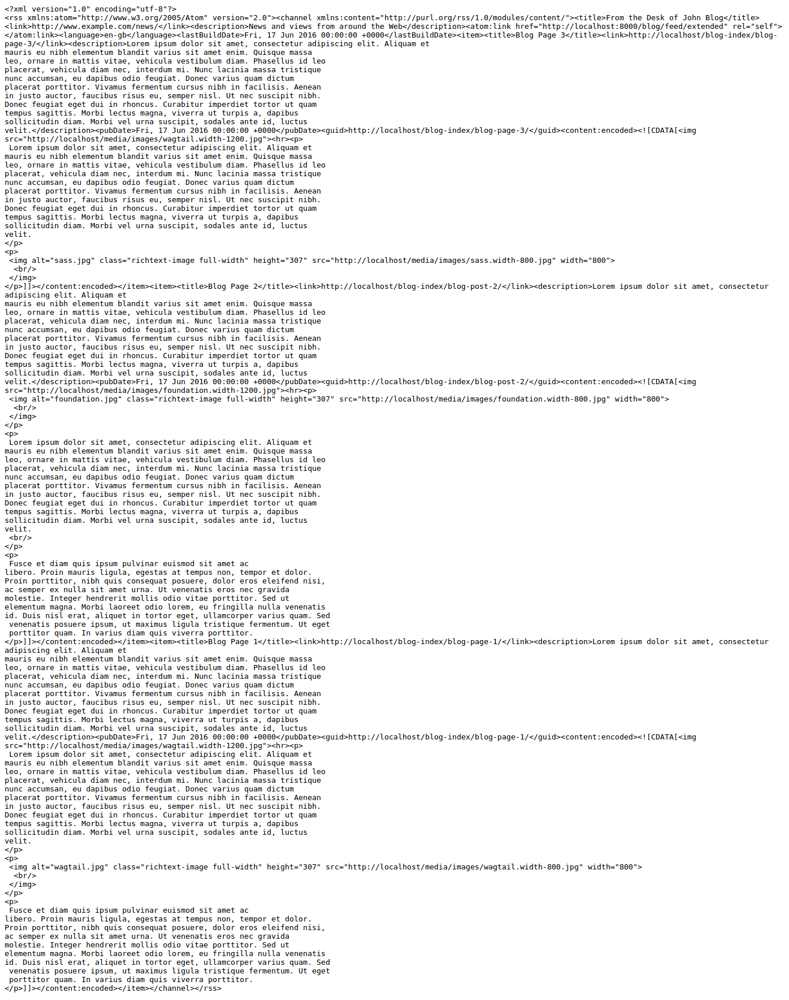

===============================
Django Wagtail Feeds
===============================

.. image:: https://img.shields.io/pypi/v/wagtail_feeds.svg
        :target: https://pypi.python.org/pypi/wagtail_feeds

.. image:: https://readthedocs.org/projects/wagtail-feeds/badge/?version=latest
        :target: https://wagtail-feeds.readthedocs.io/en/latest/?badge=latest
        :alt: Documentation Status

Support RSS Feeds, Facebook Instant Articles and Apple News

Syndication feeds come in two flavors:

 - **BasicFeed** -  A standard `RSS V 2.0.1`_ feed designed to be used without 
   item enclosures.

 - **ExtendedFeed** - An RSS V2/Atom Feed with support for item  
   enclosures such as images or video. Use this if when want to integrate your
   feed with services like MailChimp or Flipboard.

.. _`RSS V 2.0.1` : http://cyber.law.harvard.edu/rss/rss.html

Instructions
------------

- Install Django Wagtail Feeds::
    
    pip install wagtail_feeds
    
- Run migrations for Wagtail feeds::

    ./manage.py migrate wagtail_feeds
    
- Add Feed settings in the Wagtail admin

.. figure:: admin.png
   :alt: Wagtail admin
   
.. figure:: feed-settings.png
   :alt: Feed Settings
   
- Add urls for feed::

    from wagtail_feeds.feeds import BasicFeed, ExtendedFeed
    
    url(r'^blog/feed/basic$', BasicFeed(), name='basic_feed'),
    url(r'^blog/feed/extended$', ExtendedFeed(), name='extended_feed'),
    
- That's it. Your feed is ready

Contributing
------------

Contributions are always welcome to improve this project. If you think you've found a bug or are interested in contributing
fork this project and send the pull request. After review, your pull request will be merged. We are always happy to receive
pull requests. If you identify any issue, please raise it in the issues section.
